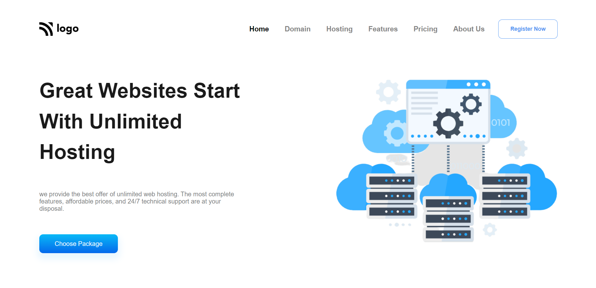
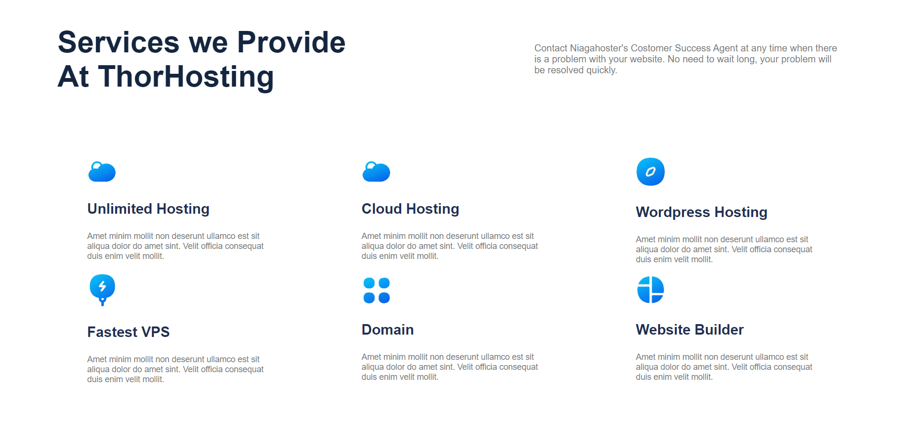
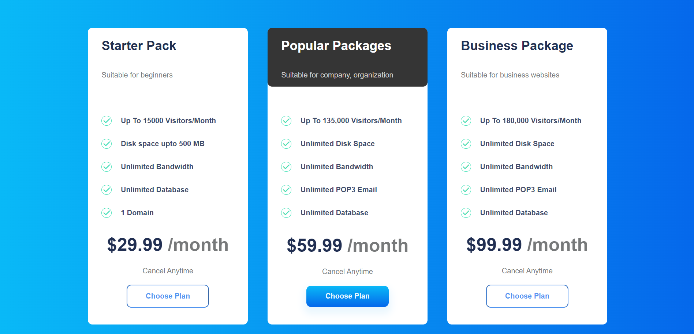
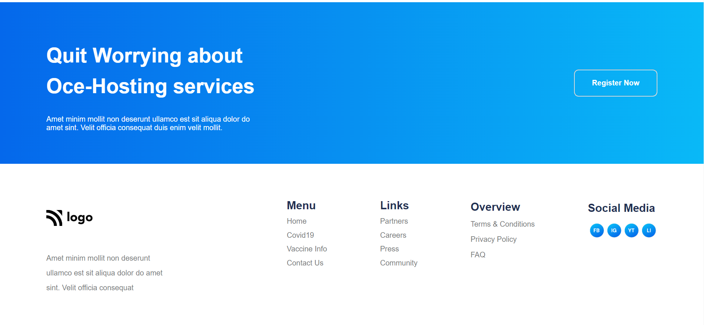

 
# Hosting Landing Website    
Hi! I am Lalita Garg and I created this project using HTML and CSS.

A Hosting  Landing Page website that is responsive for mobile and tablet screen .

This Project took around 7 hours to complete it.
***
## Key Learning 

- Media Queries 
- Flex and Flexbox
- Margin and Padding 
- Position 
- Navbar Designing 
- Responsive Design
***
# Deployment Link - [Live Link](https://hosting-landingpage-01.netlify.app/)
# Preview 

***
# Technologies Used 

